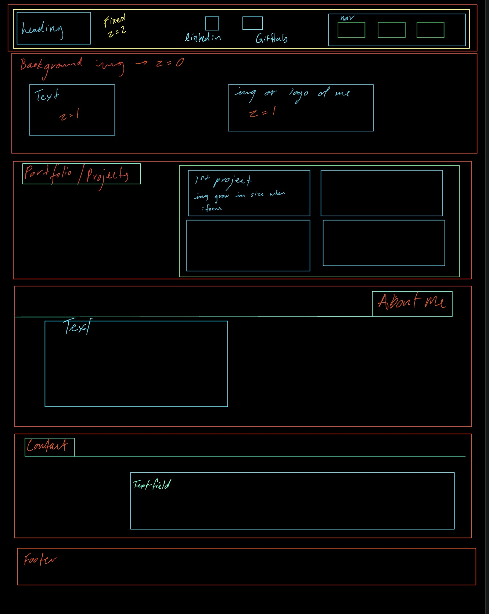
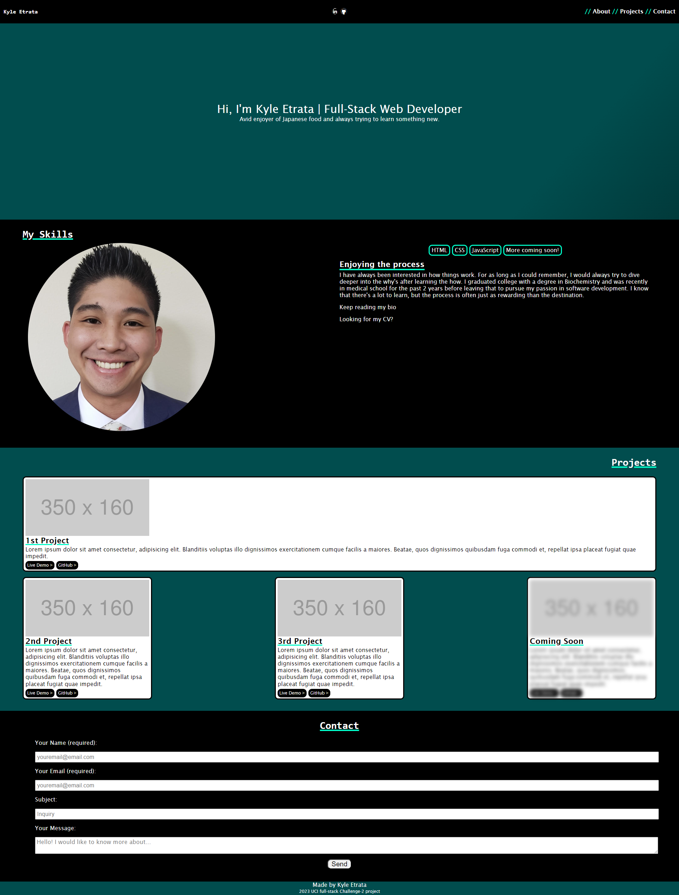

# Create a web developer portfolio

## Description

This project was done with the aim to make my first web deployed portfolio. This portfolio is important for being able to showcase my current skills to potential employers as well as show some of my character outside of the typical CV/resume. The aim is to keep updating this portfolio as I gain more skills or if I learn a different program to create the portfolio, to use this current one as the rough draft for the new one. In order to accomplish the portfolio, I first started with a wireframe to roughly outline the overall design of the web page. 

Wireframe: 

After the initial design of the wireframe, I first built out the skeleton in HTML before working on CSS.

While working on the CSS I learnt several new things:

* Animation via CSS with the use of keyframes.
* The intricacies of the flexbox property and how it helps makes things responsive at the start instead of only relying on media queries. 
* Using pseudo classes to create tooltips with little animations.

The deployed application can be found [here](https://) and looks like the following:

## Installation

Locate a suitable place where you would like to download this repository. Once found, copy the repositories SSH or HTTPS to clone through the terminal or download the zipfile from GitHub. After it is downloaded, right-click the index file and launch with your preferred internet browser. 

While in the browser, feel free to examine the HTML and CSS code in developer mode by hitting F12.

## Usage

This repository is allowed for use in a learning environment to evaluate and analyze. 

## Credits

Credits are given to the following:

* UCI full-stack coding bootcamp for the acceptance criteria for the project.
* [Font-Awesome.com](https://fontawesome.com/) for their stylesheet to add the Github and LinkedIn icons.
* [Meyerweb](https://meyerweb.com/eric/tools/css/reset/) for their open source code for the reset.css.
* Web Dev simplified for the [tutorial](https://www.youtube.com/watch?v=ujlpzTyJp-M&t=541s&ab_channel=WebDevSimplified) on tooltips.
&nbsp; [GitHub](https://github.com/WebDevSimplified) for WebDevSimplified.
* Nour Ibram for [inspiration](https://codepen.io/nouribram/pen/jYqwWJ) of the animated background in the home screen. [Portfolio](https://nouribram.github.io/portfolio/) for Nour Ibram.

## License

Please refer to the LICENSE found in the repository.
